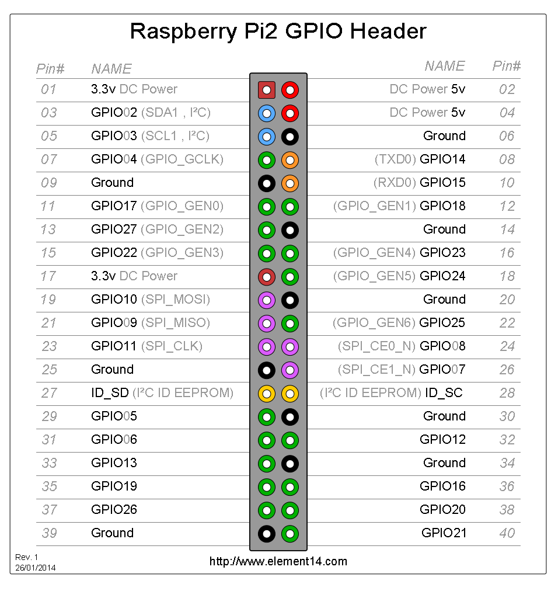

CPEN 432 / Project 1


Introduction
===

The goal of this activity is to introduce you to the Raspberry Pi hardware 
platform and help you setup your development environment. The objectives of 
this mini-project also include:
1. Understanding the **architecture** of our ARM processor, including the 
   register profile
2. Understanding the **instruction set** of our ARM processor
3. Understanding **Memory Mapped I/O (MMIO)**
1. Introducing you to **bare-metal** programming and **device drivers**. You will be 
   writing a simple device driver that implements the **Universal Asynchronous 
   Receiver-Transmitter (UART)**
2. **Debugging and printing**: You will use 
   your UART implementation to implement a print function that you will be 
   using to debug your kernels
3. Getting to know the **ARM timer** module by implementing a simple timer 
   functionality
4. **Assembly optimization and code profiling**: You will learn some of the 
   techniques that are commonly used to optimize low level code. You will be 
   optimizing the running time of a given assembly program, and you will 
   profile the time is takes to run your programs using your timer and print 
   implementations.


**This activity consists of 5 tasks**, and each section 
describing a deliverable is labeled with **[Task n]**, where n is the deliverable number. Make sure to read all the material preceding a task before 
attempting it.

------------------------------------------------------------------------------- 

# Part 1: Setup your environment

## Raspberry Pi Hardware Overview
Before you run the code bare-metal, you should get familiar with your hardware.
The Raspberry Pi (RPi) model we are using the [Raspberry Pi 2 Model B](https://www.raspberrypi.org/products/raspberry-pi-2-model-b/). The chip is a Broadcom BCM2836 system on-chip (SoC), which contains the 
following:

* CPU: 900 MHz quad-core ARM Cortex A7 (ARMv7 instruction set) 
* GPU: 250 MHz Broadcom VideoCore IV
* Memory: 1 GB (shared with GPU)

The Raspberry Pi also has the following hardware peripherals:

* 4 USB 2.0 ports (via the on-board 5-port USB hub)
* 1 15-pin MIPI camera interface (CSI) connector
* 10/100 Mbit/s Ethernet USB adapter on the third/fifth port of the USB hub 
* 3.5mm phone jack for analog audio output
* 1 HDMI port with resolutions from 640350 to 19201200 and digital audio out 
* 1 MicroSD slot

The Raspberry Pi also contains a General Purpose IO (GPIO) header, which we 
will be exposing. 

## The Toolchain
To build programs for this class you will need an ARM cross-compiling toolchain. This will allow you to build machine code for ARM from an x86 machine. You will need to install GCC, GDB, and a serial terminal emulator.

### Setup Instructions
You may use either a VM running a Linux guest or your native host machine. 
Running the toolchain directly on a native host machine is usually faster than running a VM. Below you will find instructions for directly installing the toolchain.


#### Linux

First we need to install a few manual dependencies:

`$ sudo apt-get install build-essential autoconf automake libtool libusb-dev libusb-1.0-0-dev libhidapi-dev git`

  The [ARM GCC Embedded](https://launchpad.net/gcc-arm-embedded) project supported by ARM provides precompiled binaries for Linux. We can download the binaries as a tar,
  extract to a known directory (like ~/), fix the permissions, and add them to our path:

```shell
$ cd ~/
$ wget https://launchpad.net/gcc-arm-embedded/4.9/4.9-2015-q2-update/+download/gcc-arm-none-eabi-4_9-2015q2-20150609-linux.tar.bz2
$ tar -xf gcc-arm-none-eabi-4_9-2015q2-20150609-linux.tar.bz2
$ mv gcc-arm-none-eabi-4_9-2015q2 gcc-arm-none-eabi
$ chmod -R 755 ./gcc-arm-none-eabi
$ echo "export PATH=$PATH:~/gcc-arm-none-eabi/bin" >> ~/.bashrc
$ source ~/.bashrc
```

  _(64-bit only)_ Note that these are 32-bit binaries. If you are on a 64-bit version of Linux, you will need to install the 32-bit runtime libraries:

  ```shell
  $ sudo apt-get install lib32bz2-1.0 lib32ncurses5 lib32tinfo5 lib32z1 libc6-i386
  ```

  To check that the tools are installed correctly, try to run `arm-none-eabi-gcc` and `arm-none-eabi-gdb`.


#### Mac
  Although there are a couple different package managers, we found the packages we needed in Homebrew. You can find
  installation instructions at <http://brew.sh/>. Homebrew will also require that you install the Xcode Command Line Tools.

  The [ARM GCC Embedded ](https://launchpad.net/gcc-arm-embedded) project supported by ARM provides precompiled binaries
  for Mac. Download the latest Mac .tar.bz2 package. We can then extract the binaries and add them to our path:

```shell
$ cd ~/Downloads
$ tar -xf gcc-arm-none-eabi-4_9-2015q2-20150609-mac.tar.bz2
$ mv ./gcc-arm-none-eabi-4_9-2015q2 ~/gcc-arm-none-eabi
$ echo "export PATH=$PATH:~/gcc-arm-none-eabi/bin" >> ~/.bashrc
$ source ~/.bashrc
```

To check that the tools are installed correctly, try to run `arm-none-eabi-gcc` and `arm-none-eabi-gdb`.


#### Windows
Not Supported. Use a VM running a Linux guest.

### Doxygen
Doxygen is a framework that allows you to automatically generate documentation from comments and markup tags inserted directly into the source. This style of embedding documentation in source is often used in industry. We will be using doxygen for code documentation for this course moving forward. The doxygen manual is available here: <http://www.stack.nl/~dimitri/doxygen/manual/index.html>. Steps for setup and use of Doxygen are below:

```
Installation on Linux:

$ sudo apt-get install doxygen
```
   
 
```
Installation on Mac:

$ brew install doxygen
```

At the root directory of your project, create a folder `docs`. This is the folder where all your documentation files will be generated. Follow the instructions in Doxygen's documentation to create your project's documentation files in the `docs` directory. [This section](https://www.stack.nl/~dimitri/doxygen/manual/starting.html) of Doxygen's manual is sufficient to get you going.


The following is an example file header temple, written in JavaDoc fashion, that we'd expect to see in your source files

```c
/**
 * @file   printk.c
 *
 * @brief  print function implementation for debugging raspberry pi 
 *
 * @date   Jan 5 2017
 * @author Eric Clapton <eclapton@ece.ubc.ca>
 */
```


## [Task 1] Read the Tutorial
The first step is to familiarize yourself with our processor, including its 
architecture and instruction set. Carefully read slide sets **2, 3 and 4** of 
Anthony Rowe's slides on embedded systems under [readings](https://cpen432.github.io/readings/). Slides 37-end of slide set **7** discuss linking and the 
various kernel binary files, which you will find very useful. 

Now go ahead and carefully read parts 1 and 2 of 
[Brian Sidebotham's tutorial](https://github.com/BrianSidebotham/arm-tutorial-rpi) on
bare-metal programming for the RPi platform in C. The given link is a Github repository that contains the code used in the tutorial, and also contains 
links to the individual tutorial parts.
Make sure to **compile and run** all of the given examples on your kit, particularly `part-1/armc-03` and `part-2/armc-09`. You will need to understand most of what is going on in the latter, and you will be using some of the code in that example in the next part.


**Note:** To prepare your SD card for kernel loading, make sure it is formatted in FAT32. After you build your kernel, you should copy `kernel.img` to your SD card. In addition, make sure to copy the files `bootcode.bin` and `start.elf` (both are under `boot/` in the tutorial repository) to your SD card. We provide these files for your convenience under `boot/`. Loading the 
kernel this way will require you to juggle the SD card between the RPi and your
computer every time you want to load a kernel. To eliminate this juggling, 
we will later introduce another method to flash the kernel using the UART 
through the TTL-to-USB console cable. See the last section of this document.


Upon reading the slide sets and completing parts 1 and 2 of the tutorial, answer the following questions:

1. Describe the boot process of RPi in sufficient detail (you may use a diagram to aid the description). Which hardware component is responsible for loading the kernel? At what memory address does the RPi load your kernel?
2. Is our ARM processor RISC or CISC? What is the lengh of an ARM 
   instruction (in bits)?
3. How many registers are available on our processor? What is a _banked_ 
   register?
2. Describe the roles of the `cpsr`, `spsr` and `lr` registers. Give examples 
   in ARM assembly to illustrate their purpose(s).
2. What is the C runtime? What is the difference between the C runtime and the 
   C library?
3. Do we need the C Library in the OK LED example? Why or why not?
4. What is the purpose of the `volatile` keyword in C? Give an illustrating example in the context of device drivers and how the compiler works. 
5. What is the linker and how is it different from the compiler? 
6. Briefly describe the difference between `elf` and `img` files.
7. What is the `C-Startup`, and what is the `_start` symbol? When is the `_start` section called? Give at least two functions that the `_start` is responsible for.
8. If you want to change the name of the entry point to your kernel to, say, `my_awesome_kernel_main`, describe what needs be done in order for this to work. In particular, describe the files and the code that needs to be changed.


# Part 2: MMIO, GPIO, and Debugging

## BCM2835/6 Memory Map
Recall that Memory-mapped I/O (MMIO) is a method of performing input/output 
(I/O) between the CPU and the peripheral devices. Memory-mapped I/O uses the 
same address space to address both memory and I/O devices. The memory and 
registers of the I/O devices are mapped to (associated with) address values. So when an address is accessed by the CPU, it may refer to a portion of physical RAM, but it can also refer to memory of the I/O device. Thus, the CPU instructions used to access the memory can also be used for accessing devices. MMIO is a CPU-to-device communication method, and it should not be confused with direct memory access (DMA) for a device, because, by definition, DMA is a memory-to-device communication method that bypasses the CPU. The foregoing description of MMIO 
and additional details may be found at <https://en.wikipedia.org/wiki/Direct_memory_access>.  


When dealing with addressing, it is important to distinguish **physical** and **virtual** addresses. To understand the virtual-to-physical address translation in our SoC, it is insightful to study page 5 of the `BCM2835.pdf` datasheet (note that 
the SoC on the RPi 2 is BCM283**6**, but I/O Peripheral documentation is only available for the older BCM2385). On this page, the memory map on the left represents the shared virtual memory layout between the GPU and ARM CPU. The memory map in the center represents the physical memory layout seen by an ARM CPU. The memory map on the far right represents the virtual memory layout of a given ARM CPU if we were going to use the ARM MMU. Starting with the memory map on the left, we see that I/O Peripherals (just another name for MMIO) is addressed virtually at `0x7E000000`. Trying to access this address directly would be a problem since our given ARM CPU only has access to the 2 memory maps in the center and on the right depending on whether the ARM MMU is on or off. The memory map on the left is only visible to the GPU.

All MMIO in our BCM2386 starts at address `0x3F000000`. This is the MMIO base **physical** address (note that the MMIO base physical address of the older BCM2385 is `0x20000000`, and the `BCM2835.pdf` datasheet does not contain the new physical address). Depending on the peripheral you are accessing, the offset from the MMIO base physical address changes. In the `BCM2835.pdf` datasheet, all MMIO addresses given are in virtual address form. For example, on page 9 of the 
`BCM2835.pdf` datasheet, the `AUXENB` register is listed at address 
`0x7E215004`. Accessing this address directly will not work. _When running 
bare-metal, the MMU (Memory Management Unit) that does virtual-to-physical address translation is turned off_. So we must convert this virtual address to a physical one. Again, for the RPi 2, all MMIO begins at `0x3F000000`. So the physical address of the `AUXENB` register would be 
`0x3F000000 + 0x00215004 = 0x3F215004`. You basically just replace the upper byte of the address with `0x3F`.

Depending on whether the ARM MMU is on or off, we would use either the memory map on the far right or in the center. _In this course we will not be using the MMU_. We ignore the map on the right and use the one in the center. Now we see that I/O Peripherals are mapped to the physical address `0x20000000` for the ARM CPU in the BCM2835 SoC. Remember that the MMIO base physical address of our RPi 2 is `0x3F00000`, since the RPi 2 uses the BCM2836 SoC and not the BCM2835 SoC. Overall, the MMIO environment between the 2 chips is essentially the same except for this main difference.

## GPIO on the RPi
The GPIO layout begins on page 89 of the `BCM2835.pdf` datasheet. The MMIO base offset for GPIO is `0x7E200000`, which is `0x3F200000` on the RPi 2. Each of the GPIO pins has multiple functions. This is best illustrated in the table on pages 102 to 103. Each GPIO pin has different functions it can serve as from `ALT0` to `ALT5`. The GPIO pin numbers in the far left column of the table correspond 
to the following GPIO pin layout on the header which our breakout board is attached to:




## [Task 2] UART on the RPi
We will implement UART. This will allow you to send characters to the 
terminal on your computer and thus debug your kernel using print statements. 
We will be implementing a **polled** UART interface.  


For implementing UART, you will find pages 9-19 of the `BCM2835.pdf` 
datasheet very useful. Most of the information you will need is in those pages.
**NOTE: YOU SHOULD ALWAYS CHECK THE DATASHEET ERRATA BEFORE YOU CODE ANYTHING! it is quite common for datasheets to have incorrect information on them. As an embedded designer, you should always check the datasheet errata before implementing any code based off the datasheet alone. The errata for the BCM2835.pdf datasheet can be found here**  
<http://elinux.org/BCM2835_datasheet_errata>  


You are to implement the functions listed in `uart.c`. The body of each 
function to be implemented contains the comment `/* TODO: implement */`.  


Your UART implementation depends on the GPIO implementation. To make things 
easier for you, we provided a GPIO library (courtesy [Anthony Rowe of CMU](https://users.ece.cmu.edu/~agr/)) in 
`gpio.h` and `gpio.c`.  We will now walk through how to configure the GPIO for UART to help explain how the GPIO library works. Notice the GPIO pin numbers for the `RX` and `TX` lines
of UART. We need to configure these pins to enable UART.

```c
/** @brief GPIO UART RX pin */
#define RX_PIN 15
/** @brief GPIO UART TX pin */
#define TX_PIN 14
```

Before we configure the pins to the right function according to the table on page 102 of the `BCM2835.pdf` datasheet, we must handle the pull-up/down resistor on each GPIO pin with the GPIO library. Pull-up/down resistors are commonly used with microcontrollers (MCUs). Sparkfun has a great tutorial on what these are here:  
<https://learn.sparkfun.com/tutorials/pull-up-resistors>  

**NOTE**: You **disable** pull-up/down resistors for data lines like `RX` and 
`TX` since they are data lines and should only be read when driven.

```c
// configure GPIO pullups
gpio_set_pull(RX_PIN, GPIO_PULL_DISABLE);
gpio_set_pull(TX_PIN, GPIO_PULL_DISABLE);
```

Now we use the GPIO library to configure the pins for the correct functions listed in the GPIO table page 102 of the `BCM2835.pdf` datasheet:

```c
/* set GPIO pins to correct function on pg 102 of BCM2835 peripherals */
gpio_config(RX_PIN, GPIO_FUN_ALT5);
gpio_config(TX_PIN, GPIO_FUN_ALT5);
```
After this point, the UART interface on the Pi is now available on the GPIO pins we configured!  

Here are some tips:

1.   The `AUXENB` register is used to enable access to the MMIO peripherals of UART.
     This should be the first thing you do in `uart_init()`.
2.   For the equation on page 11 of the `BCM2835.pdf` datasheet, the `system_clock_freq` is 250MHz.
3.   The `AUX_MU_IER_REG` register should be set to 0. You should not enable interrupts for UART.
4.   In the `AUX_MU_IIR_REG` register, you only care about the bits pertaining to clearing the FIFOs.
5.   The base _virtual_ address for UART MMIO is `0x7E215040`. In `uart.h`, you need to create definitions of the virtual MMIO addresses of all the relevant
     UART registers right after the pin definitions. For example, you'd 
     define the address of the `AUXENB` register as 

       ```c
       /** @brief define AUXENB register */
       #define AUXENB_REG (volatile uint32_t *)(MMIO_BASE_PHYSICAL + 0x??????)
       ```
   
     where `MMIO_BASE_PHYSICAL` is defined in `BCM2836.h`, and `0x??????`
     is to be replaced with the offset of the `AUXENB` register 
     relative to the MMIO base physical address. In your UART function 
     implementations in `uart.c`,
     you'd read and set the value of `AUXENB` using `AUXENB_REG` (the same
     applies to all the other UART registers). Your implementations will mostly
     involve reading and setting these registers.
     
6.  Do not set `DLAB access` inside of the `AUX_MU_LCR_REG` register.
7.  Ignore the `AUX_MU_MCR_REG` and `AUX_MU_MSR REG` registers.
8.  Ignore details about `CTS` and `RTS` in all UART MMIO registers.
9.  The `AUX_MU_BAUD` register is where you should put your baud value after 
     solving the equation on page 11 for `baudrate_reg`.

## [Task 3] Debugging and printing

To debug your kernel, you are to implement a `printk()` function. 
Your `printk()` function's implementation depends on your UART 
implementation to output 
characters. We provided some starter code in `printk.c`. The signature of your 
`printk()` function is similar to that of the `printf()` function that you 
love. The first input is a string with format specifiers.
Your `printk()` function should be _variadic_: It takes an arbitrary number
of inputs after the format string; for instance, the following

```c
char *dept_name = "CPEN";
int course_num  = 432; 
printk("Welcome to %s %d", dept_name, course_num);
``` 
should print `Welcome to CPEN 432`. 

Your `printk()` function should be able to handle the following formats:

1. **Numbers** in bases 8, 10, and 16:  
    a. **Octal**; format specifier is `o`. Prepend `0` to output  
    b. **_Signed_ decimal**; format specifier is `d`  
    c. **_Unsigned_ decimal**; format specifier is `u`  
    d. **Hex**; format specifier is `x`. Prepend `0x` to output  
2. **Character**; format specifier is `c`  
3. **Strings**; format specifier is `s`  
4. **Pointers** (addresses); format specifier is `p`. Print address in Hex.

Implement your `printk()` in the file `printk.c`, which is provided under 
`source/opt/src`, along with `source/opt/include/printk.h`. You will find the 
type `va_list` and the macros 
defined in `kstdarg.h` useful for parsing the format string. Make sure to check
for invalid format strings and return errors properly. 


<!-- At this point you will use a very basic build setup in order to test your  -->
<!-- `printk()` and UART implementations in isolation.  -->

<!-- Here you need to write a main function in a separate file. Call the file -->
<!-- `kernel.c` and the main function `kernel_main`. This function should use  -->
<!-- your `printk()` to print strings, numbers, and mixtures of which. Remeber to  -->
<!-- initialize the UART at the very beginning.  -->


## Interlude: Kernel flashing using the UART and the console cable

To transfer files between your computer and the RPi, you will be using a **USB-to-TTL console cable** from AdaFruit. Follow the steps [in this tutorial](https://learn.adafruit.com/adafruits-raspberry-pi-lesson-5-using-a-console-cable) carefully to properly connect the console cable pins to your RPi and install the 
required device drivers on your computer. 


**Warning: Leave the red lead of the cable UNATTACHED. 
This is a 5V power connector which we do not need since the RPi is powered using
the supplied USB power adaptor. Connecting the red lead of the cable might fry your RPi.**


Having introduced the UART and the TTL-to-USB console cable, we are ready to 
describe a method to flash the kernel to the SD card while the SD card is 
connected to your RPi. That is, you will not need to do the SD card dance you 
did earlier to transfer your kernels. This significantly reduces the SD card's 
wear and tear resulting from juggling. 

We will carry out the following step once. Make sure that the TTL-to-USB console cable is properly connected to your 
computer and the RPi. Connect your SD card to your development machine. Under `boot/`, copy the file `kernel7.img` to your SD card. **Do not change the name of** `kernel7.img`. Keep both `bootcode.bin` and `start.elf` on the SD card. Remove any other `.img` files. Your SD card should contain only 3 files: `bootcode.bin`, 
`start.elf`, and `kernel7.img`. These files will stay permanently on your SD card hereafter.


Now insert your SD card into your RPi. To transfer files to the 
RPi, we will use 
`picocom`, which you can get on macOS from brew using the command `brew install picocom`. 


We will be transferring the ascii `.hex` files of you kernels, as opposed to the binary `.img` files. The bootloader does not work on binary files. To flash a kernel to your SD card, follow these steps:

1. Turn OFF the RPi
2. Turn ON the RPi
3. Launch picocom by typing the following command (assuming the name of the serial port to which the USB-to-TTL console cable is connected is `/dev/cu.SLAB_USBtoUART`) 
```shell
picocom /dev/cu.SLAB_USBtoUART -b 115200 --receive-cmd "ascii-xfr -r -v" --send-cmd "ascii-xfr -s -v"
```
4. Press `Ctrl-a` `Ctrl-s` (holding the `Ctrl` key) to send an ascii file
5. Choose the `.hex` file for the kernel. To convert a `.elf` file to a `.hex` file, use the following command (assuming your kernel file's name is `kernel.img`): 
```shell
arm-none-eabi-objcopy kernel.elf -O ihex kernel.hex
```
6. After the transfer completes and _while in picocom_, press `g` to run the kernel
7. To exit picocom, press `Ctrl-a` `Ctrl-x`.

# Part 4: Timer and Code Profiling

## [Task 4] ARM Timer
There are two timer peripherals available on the BCM2835/6 SoC: The _system 
timer_ (description is in section 12 of `BCM2835.pdf`, starting at page 172) 
and the _ARM timer_ (description is in section 14 of `BCM2835.pdf`, starting at page 196). We will be using the ARM timer, which is similar to the ARM SP804 
timer module (but differes in some ways). 

_Start by reading slide set **6** (on timers and interrupts) of 
Anthony Rowe's slides on embedded systems under [readings](https://cpen432.github.io/readings/)._

You will implement timer functionality that you can use in the next task to 
profile code. For this task, you only need to implement two 
fuctions: `start_countdown()` and `timer_latch()`.


By default, the 32-bit ARM timer is set to decrement, 
so we want to load the initial value of timer as `0xFFFFFFFF` (max time) and 
configure the timer to count down at a rate where we can see at least 
millisecond time granularity. As kernel `kernel.c` file suggests, 
`start_countdown()` will zero and start the timer while `timer_latch()` will 
return the number of milliseconds that have elapsed since `start_countdown()`. 
Make sure that your code does not run so long that the timer underflows. 
Since the timer value is decrementing, you will need to make necessary 
adjustments when returning the elapsed time. We use MMIO registers to 
configure the timer operations. The function definitions in `basic_timer.h` 
describe the interface you need to implement, which is in `basic_timer.c`

In `basic_timer.h`, the first thing to do is to define a pointer to the 
MMIO base virtual address of the ARM timer in order to reference its 
register set (similar to what we
did for the UART's `AUXENB`) as follows:
```c
#define TIMER_BASE (volatile uint32_t *)(MMIO_BASE_PHYSICAL + 0x??????)
```
where `0x??????` is to be replaced with the offset of the timer base address 
relative to the MMIO base physical address. 
In a similar fashion, you need to complete the definition of the addresses 
of all the timer registers in `basic_timer.h` and then use these definitions 
in your implementations in `basic_timer.c`.

## [Task 5] Code profiling and optimization
Here you will use your `printk()` and timer functions to profile the running 
time of assmebly code. You will apply your knowlege of assembly programing 
towards optimizing a simple assembly program. The goal in this case will be to decrease the length of time it takes to execute a section of the program. 


_The first thing you need to do is to read carefully slide set **7** (on program optimization and code profiling) of 
Anthony Rowe's slides on embedded systems under [readings](https://cpen432.github.io/readings/)._

Upon reading the slide set, make sure to copy your implementations 
of the previous parts to 
`source/opt/include` and `source/opt/src`. In this part you are given a makefile under 
`source/`, which you can (and should) use to compile `source/opt/kernel.c` (which is 
the test kernel for this part). You may compile and link this kernel by typing
```shell
make PROJECT=opt
```
This will link in and test two assembly code files (`optimized.S` and 
`unoptimized.S`) that are located in `opt/src/`. This will also create the 
file `kernel.img`. 


Assembly files `optimized.S` and `unoptimized.S` contain 
identical code (except for the names of some functions). If you run the test kernel with your timer function, you 
will see that the two functions will have relatively similar system tick counts. Your goal is to modify `opt/src/optimized.S` to run faster 
(goal of **5x** faster) by applying the optimization techniques outlined in the 
in the slide set. The two arrays resulting from two codes must be identical and we might test your new assembly code against an unknown test vector. 


You should leave `unoptimized.S` untouched. The test kernel `kernel.c` provided
to you in `opt/src/` calls the two functions (`optimized()` and 
`unoptimized()`) on the same input array and calls your timer functions
to measure the running time
of each. It also uses your `printk()` to display these running times. In 
addition, it checks whether both functions produce the same output on the same 
input and declares failure otherwise. You have to test the correctness of your 
optimized version thoroughly on various input vectors. Make sure to provide all the test cases and, for each test case, print the _speedup_ in addition to the 
running times.

-------------------------------------------------------------------------------

### Grading Guidelines

We will use the following _approximate_ rubric to grade your work:		

| Task | Grade Contribution |		
|:----:|:---:|
| 1 (Tutorial) | 15% |
| 2 (UART) | 25% |		
| 3 (printk) | 20% |
| 4 (timer) | 20% |		
| 5 (optimization) | 20% |

Functionality apart, we will evaluate your submissions carefully along the following dimensions:
+ code style (i.e., readability and judicious choice of variable and function 
  names, etc);
+ clear Doxygen documentation of every function;
+ implementation of tests (high test coverage);
+ code-level comments as appropriate.

Remember that a substantial percentage of your grade will be assigned during 
the demos, so _prepare a nice demo!_ 

# Further Remarks
1. In all of your implementations, make sure to use the integer types defined 
in `kstdint.h`;  
2. For testing `printk()` in isolation, you can build it either using the 
   provided makefile for `opt` and modifying `config.mk` to produce the test 
   kernel, or you can copy the 
   relevant files required by `printk.c` and build using a proper 
   modification of the shell file `part-2/armc-09/build-rpi-2.sh` in 
   [Brian Sidebotham tutorial's github repository](https://github.com/BrianSidebotham/arm-tutorial-rpi).


# Submission instructions
1. For **Task 1**, submit all your answers in a Gitlab wiki page titled `tutorial`;
2. For **Task 2**, define all the UART MMIO register addresses in `uart.h` and 
   implement all the functions in `uart.c` whose body includes
   the comment `/* TODO: implement */`;
3. For **Task 3**, provide your implementation in `printk.c`. Remember to 
   provide the build instructions of the test kernel in a wiki page titled 
   `printk build instructions`;
4. For **Task 4**, define all the timer MMIO addresses in `basic_timer.h` and 
   implement all the functions in `basic_timer.c` whose body contains
   the comment `/* TODO: implement */`;
5. For **Task 5**, you need to provide in `kernel.c` test input vectors that 
   demonstrate both the correctness of your implementation _and_ the speedup 
   resulting from your optimization.  
